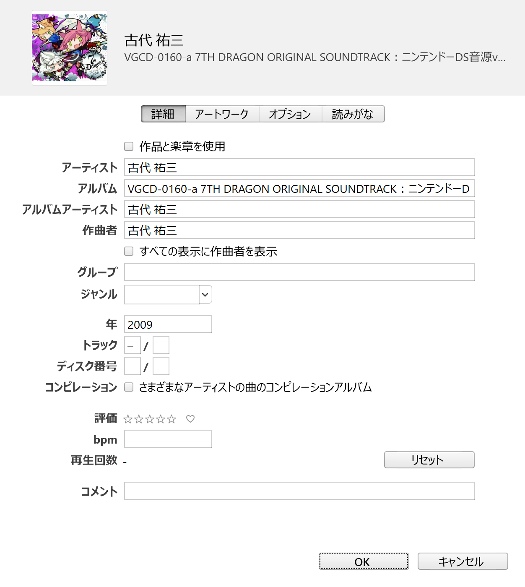
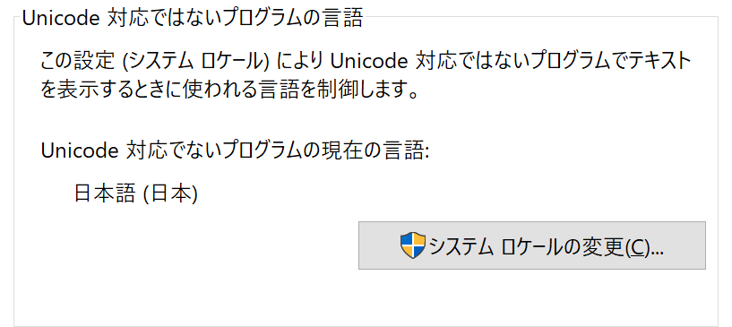

---

theme : "black"
transition : "none"

---

# MP3 のタグ情報

---

## このスライドでわかること

- MP3のタグ構造について
- MP3のタグのデファクト最適解

---

## このスライドでわからないこと

- MP3のオーディオデータの構造について
- MP3のタグの細かい編集

---

## MP3 のタグ情報の例

---

## MP3 のタグ情報の例2

---

## MP3 のタグ情報 is 何？

🤔

---

## MP3 のタグ情報 is ID3 tag

🎵 🔖

---

## ID3 tag の特徴

- MP3にメタデータを格納するための規格。
  - MP3にメタデータを格納するための規格。
- __基本的に前方互換性は保障されていない。__

---

## ID3 tag の種類

ID3 tag は version 1 と version 2 の2系統がある。

- ID3v1
- ID3v2
  - ID3v2.3
  - ID3v2.4

---

## 図. ID3v1 の構造

---

## 図. ID3v2 の構造

---

## MP3 の構造と ID3 tag

|MP3|
|:---:|
|ID3v2（variable length）|
|Audio data（variable length）|
|ID3v1（128bytes）|

---

## ID3v1 vs ID3v2

- ジャケット画像などを含められる ID3v2 が広く利用されている。
- また、文字コードやメタデータを柔軟に指定できるのも大きい。
- ID3v1 で保持できるメタデータは ID3v2 ですべて対応できる。
- ID3v1 のことは忘れよう 🔨

---

## ID3v2.3 vs ID3v2.4 - 特徴比較

- ID3v2.3 が最も普及している規格である。
- 最新の規格である ID3v2.4 は普及率が高くない。
- ID3v2.4 では利用できる文字コードに UTF-8 が加わった。
  - ID3v2.3 では、ISO-8859-1(Latin-1) と UTF-16 のみ。

---

## ID3v2.3 vs ID3v2.4 - 利用状況

- [ID3.org](http://id3.org/) では、v2.3 が一般的で、 v2.4 は一般的な地位が得られていないと述べられている (2013)。
- [HydrogenAudio](https://hydrogenaud.io/index.php/topic,109772.0.html) では、ミュージックプレイヤーの対応状況から UTF-16でv2.3の使用が推奨されていた (2015)。
- [MusicBeeのフォーラム](https://getmusicbee.com/forum/index.php?topic=20536.0) では、v2.3 が多数派のなか、タグの種類からv2.4 を採用する人もいた (2016)。

---

## ID3v2.3 を使う 3つの理由

- 事実上の標準技術
- アプリの対応状況
- ユーザーの高い利用率

---

## ID3v2.3 はどんなもの？

🤔

---

## ID3v2.3 の構造

MP3ファイルの先頭に、次の情報が付加されている。

|fieald|length||
|---|---|---|
|Header|10 bytes||
|Extended header|variable length|OPTIONAL|
|Frames|variable length||
|Padding|variable length|OPTIONAL|

---

## ID3v2.3 Header

|fieald|length||
|---|---|---|
|\*Header|10 bytes||
|Extended header|variable length|OPTIONAL|
|Frames|variable length||
|Padding|variable length|OPTIONAL|

---

## ID3v2.3 Header layout

ヘッダーは10バイトで次の情報を持ちます。

||information|length|
|--|--|--|
|ID3v2/file identifier |     "ID3"|3 bytes|
|ID3v2 version         |     $03 00|2 bytes|
|ID3v2 flags           |     %abc00000|1 bytes|
|ID3v2 size            | 4 * %0xxxxxxx|4 bytes|

---

## ID3v2.3 Header - flags

ほとんど使われていないため割愛

---

## ID3v2.3 Header - size

ヘッダーにおけるサイズ情報は、次のように保持されている。

- 最上位ビットがすべて0になるようにエンコードされた4バイトのデータで、全部で28ビットのデータである。
- 保持されるサイズ情報の単位はバイトである。
- ヘッダーの10バイトは含まれない（総タグサイズ-10バイト）。

||information|length|
|--|--|--|
|ID3v2 size            | 4 * %0xxxxxxx|4 bytes|

---

## ID3v2.3 Extended header

ほとんどの場合に使わないため割愛

---

## ID3v2.3 Frames

|fieald|length||
|---|---|---|
|Header|10 bytes||
|Extended header|variable length|OPTIONAL|
|\*Frames|variable length||
|Padding|variable length|OPTIONAL|

---

## ID3v2.3 Frames - overview

タグ情報は1つ以上のフレームで構成され、  
すべてのフレームはヘッダーと本体から構成されます。

---

## ID3v2.3 Frames header layout

フレームのヘッダー構造は次に示す通りです。

||information|length|
|--|--|--|
|Frame ID |$xx xx xx xx|4 bytes  (four characters)|
|Size     |$xx xx xx xx|4 bytes|
|Flags    |$xx xx      |2 bytes|

---

## ID3v2.3 Frames - Frame ID

フレーム IDは0-9と大文字のA-Zで構成されている。
v2.3 の規格は 74種類のFrameIDが定義している。

|Frame ID|information|
|--------|-----------|
|APIC    |付属する画像|
|TALB    |アルバムのタイトル|
|TCON    |コンテンツのタイプ（ジャンル）|
|:       ||

---

## ID3v2.3 Frames - Size

サイズ情報はフレームの総サイズからヘッダサイズを除いたものである（フレームサイズ-10）。

バイト単位の値がビックエンディアンで格納されている。

---

## ID3v2.3 Frames - Flags

ほとんどの場合に使わないため割愛

---

## ID3v2.3 Frames - Text

ID: "T000" - "TZZZ"

|  |information|
|--------|-----------|
|Text encoding| $xx|
|Information  |`<text string>`|

---

## ID3v2.3 Frames - Text encoding

エンコーディングは次のように定められている。

|$xx|encoding|
|---|----------|
|$00|ISO-8859-1(Latin-1)|
|$01|Unicode(UTF-16)|

---

## 日本語なのに $00 の指定がある

🤔

---

## ISO-8859-1でやってくれ

`No!No!No!No!No!`

（日本語の文字集合は含まれない）

---

## ゆ、UTF16？

`No!No!No!No!No!`

（UTF16の指定は `$01` である）

---

## もしかしてCP932ですかーッ⁉

`Yes!Yes!Yes! "OH MY GOD" ¯\_(ツ)_/¯`

---

## 日本語なのに $00 の指定の場合

「Unicode 対応でないプログラムの現在の言語」を使用されることがある。

---

## CP932..

😕

---

## UTF16に変換しよう

mp3tagなど編集ツールがあるため、これらを活用していきましょう。

---

## ID3v2.3 Frames - APIC

付加された画像（アルバムのジャケット等）

|  |information|
|--------|-----------|
|Text encoding|$xx|
|MIME type    |`<text string>` $00|
|Picture type |$xx|
|Description  |`<text string>` $00 (00)|
|Picture data |`<binary data>`|

---

## ID3v2.3 Padding

- Header で示されたタグサイズよりフレームの総サイズが小さい場合、残りの領域に Padding 領域が配置される。
- この領域はすべて $00 で埋められる。

---

## DEMO

---

## まとめ

- ID3v1 はやめるべき
- ID3v2.3 が安定している
- タグ情報はできるだけUTF16に変換しよう

---

Thank you so much for your kind attention.

